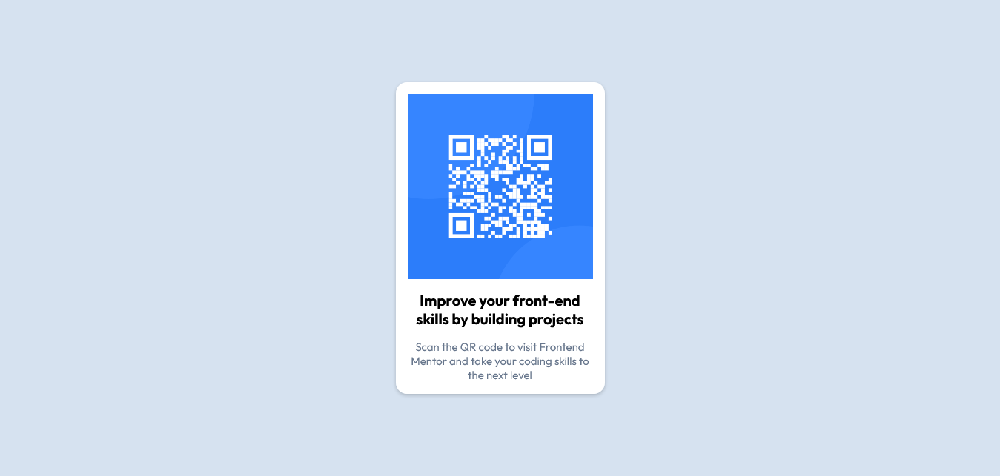

# Frontend Mentor - QR code component solution

This is a solution to the [QR code component challenge on Frontend Mentor](https://www.frontendmentor.io/challenges/qr-code-component-iux_sIO_H). Frontend Mentor challenges help you improve your coding skills by building realistic projects.

## Table of contents

- [Overview](#overview)
  - [Screenshot](#screenshot)
  - [Links](#links)
- [My process](#my-process)
  - [Built with](#built-with)
  - [What I learned](#what-i-learned)
- [Author](#author)

## Overview

### Screenshot



### Links

- Live Site URL: [Github](https://alfizain.github.io/qr-code-frontend-mentor/)

## My process

### Built with

- Semantic HTML5 markup
- CSS
- Flexbox

### What I learned

```css
:root {
  --White: hsl(0, 0%, 100%);
  --Slate-300: hsl(212, 45%, 89%);
  --Slate-500: hsl(216, 15%, 48%);
  --Slate-900: hsl(218, 44%, 22%);
}
```

## Author

- Website - [Muhammad Alfi Zain](https://alfizain.github.io/AlfiZain/)
- Frontend Mentor - [@AlfiZain](https://www.frontendmentor.io/profile/AlfiZain)
